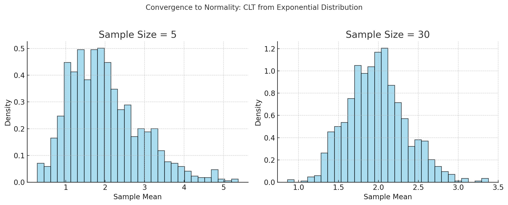

# Problem 1

---

# 📊 **Exploring the Central Limit Theorem (CLT) Through Simulations**

---

## 🌟 Motivation

The **Central Limit Theorem (CLT)** is one of the most profound results in probability and statistics. It states:

> As the **sample size increases**, the **distribution of the sample mean** of independent, identically distributed (i.i.d.) random variables **approaches a normal distribution**, regardless of the population's original distribution (provided the population has finite variance).

This theorem is foundational because it **justifies** the widespread use of **normal approximations** in real-world problems, such as:

* Confidence interval construction
* Hypothesis testing
* Quality control
* Polling and surveys
* Financial risk assessment

Despite its theoretical depth, the CLT is **best understood through visualization and simulation**, which is what this project offers.

---

## 🧪 Simulation Objectives

You will simulate how sample means behave for various distributions and visualize how, as the sample size increases, the distribution of the sample mean:

* Becomes **more symmetric**
* **Narrows** in spread (reduced variance)
* **Approaches the bell-shaped curve** of the normal distribution

---

## 🧰 Steps of the Simulation

### 🔹 1. Choose Population Distributions

Select a few contrasting distributions:

| Distribution            | Description                           | Example Use Case                                     |
| ----------------------- | ------------------------------------- | ---------------------------------------------------- |
| **Uniform (0, 1)**      | Constant probability over an interval | Randomized algorithms, simulations                   |
| **Exponential (λ = 1)** | Skewed, long-tailed                   | Time between Poisson events (e.g. radioactive decay) |
| **Binomial (n, p)**     | Discrete, bounded                     | Success/failure counts                               |
| **Poisson (λ)**         | Discrete, skewed                      | Rare event counts                                    |
| **Normal (μ, σ²)**      | Symmetric, bell curve                 | Height, weight, test scores                          |

---

### 🔹 2. Generate Samples and Compute Means

For each distribution:

1. Fix a population (e.g., generate 10,000 random values).
2. Choose sample sizes: $n = 5, 10, 30, 50$.
3. For each sample size:

   * Take many random samples (e.g., 10,000 samples of size $n$).
   * Compute the **mean** of each sample.
   * Store these sample means.

---

### 🔹 3. Visualize the Results

For each sample size and distribution:

* Plot a histogram of the **sample means**.
* Overlay a **normal distribution curve** (same mean and variance) for comparison.
* Observe:

  * **Convergence to normality**
  * **Reduction in spread** as $n$ increases
  * The original distribution's influence diminishes with larger $n$

---

## 🔍 Parameter Exploration

### 📌 Effect of Sample Size $n$

As $n$ increases:

* The sample mean becomes **less variable**
* The distribution becomes **more normal**
* The standard deviation of the sample mean becomes:

  $$
  \sigma_{\bar{x}} = \frac{\sigma}{\sqrt{n}}
  $$

### 📌 Effect of Population Shape and Variance

* Distributions with **greater skew** or **longer tails** require **larger $n$** to approximate normality.
* The **original variance** affects how wide the distribution of the sample mean is.

---

## 🧠 Practical Applications

| Field               | CLT Role                                      |
| ------------------- | --------------------------------------------- |
| **Polls & Surveys** | Justifies margin of error in political polls. |
| **Quality Control** | Used in Six Sigma and control charts.         |
| **Finance**         | Predicting mean returns, risk estimation.     |
| **Medicine**        | Estimating average treatment effect.          |
| **Manufacturing**   | Sampling batches for consistency testing.     |

The CLT helps practitioners **generalize from small samples** to the larger population, with confidence.

---

## 📝 Example Results Interpretation

Let’s say we used an **exponential distribution** (highly skewed):

* **Sample size 5**: Histogram of sample means is still skewed.
* **Sample size 30**: The distribution of means is **visibly bell-shaped**.
* **Sample size 50**: Distribution looks **very close to a normal curve**.

➡️ This demonstrates CLT in action: despite the skewed population, the sample mean becomes **normally distributed**.

---

## 🧾 Deliverables Summary

| Item                          | Description                                                                          |
| ----------------------------- | ------------------------------------------------------------------------------------ |
| ✅ Jupyter Notebook / Markdown | Implements the simulation, provides plots and commentary                             |
| ✅ Histograms                  | For each population and sample size, with normal overlays                            |
| ✅ Parameter analysis          | Vary sample size, distribution, variance                                             |
| ✅ Discussion                  | Why CLT holds, when it fails (e.g., infinite variance cases), and real-world meaning |

---

## 🧠 Additional Tips & Extensions

* Try a **Cauchy distribution** (infinite variance) and show that CLT **doesn’t** apply.
* Use **Q-Q plots** or **Shapiro-Wilk tests** to measure normality.
* Animate how the distribution of means **changes over $n$**.

---

## 🔚 Summary

This simulation brings to life one of statistics’ most powerful theorems:

* It shows how normality **emerges** from randomness.
* It reveals the **invisible structure** behind data sampling.
* And it underpins **inference**, allowing us to trust conclusions drawn from limited observations.

By running this project, students gain intuition and confidence about the CLT—far more than by memorizing formulas alone.

---
